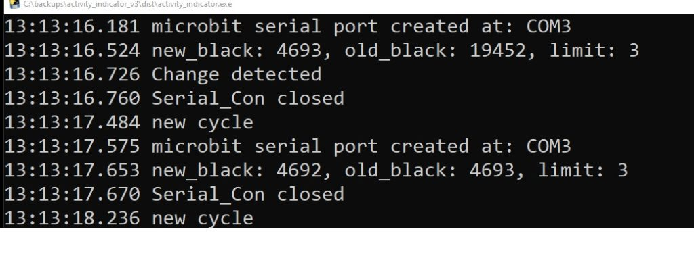
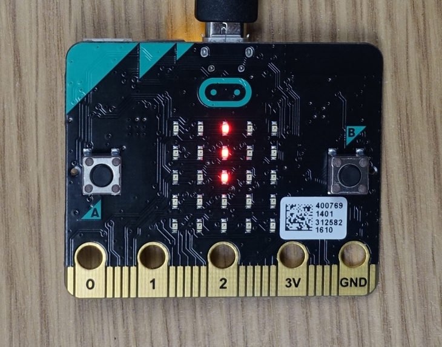

# Give Me a Minute set up and use instructions

[Matthew Oppenheim](matt.oppenheim@gmail.com)

This page details how to set up and use the [Give Me a Minute](https://www.seismicmatt.com/give-me-a-minute/) system to show when communication software is in use.

A YouTube video showing how to set up the system which complements these instructions can be [viewed here](https://youtu.be/MvV-veL01No)

The Project GitHub site is at [this link](https://github.com/hardwaremonkey/microbit_activity_indicator).

* November 2020 this manual is now rendered using [mkdocs](https://www.mkdocs.org/).
* 17th September 2020: Added how to unblock activity_indicator.exe the first time that it is run.
* 11th October 2019: Allows for the microbit to be disconnected and reconnected in use.
* 3rd October 2019: Changed how to run the program at start-up from using a .cmd file in the Startup directory to using a link.

## Introduction

It can be hard to know when an eye tracker user is composing speech on their communication device. The ‘Give me a minute’ project solves this by using a BBC micro:bit (microbit) to indicate when communication software, such as Sensory Software’s Grid 3 or Tobii’s Communicator, is in use. See the page: [Give Me a Minute](https://www.seismicmatt.com/give-me-a-minute/ for details, photos and videos of the system in action.

The ‘Give me a minute’ software works by looking for a change at the top of the communication software window twice a second. A microbit is attached to the communication device. When the text in the communication software is changed the microbit's LEDs flash. 

Let me know if these instructions can be improved.

### Testing

The system has been tested with Windows 8 and Windows 10 on Sensory Software’s Grid 2 and Grid 3 and Tobii’s Communicator software. 

### Components

* One microbit. This can be obtained for around £12. eBay is a good place to buy one. 

* A micro USB cable is needed to connect the microbit board to the device running the communications software. 

* An optional case can be bought for the microbit. 

## Set up - summary

I call the device which is running the communication software as the communication device. 

Connect the microbit using a micro USB cable from the microbit to the communication device. You do not need a battery pack for the microbit. The microbit is powered from the USB connection.

*    Install the driver for the microbit if you are not using Windows 10.
*   Connect the microbit using a USB cable to the device with the communication software on it.
*   Download the setup files from my GitHub site to the communication device.
*    Drag and drop the file ubit_flash.hex to the microbit.
*    Run Grid 2 or Grid 3 or Tobii Communicator.
*    Run activity_indicator.exe.
*    Optional: set up Windows so that the file activity_indicator.exe runs automatically at start-up.

### Regular use after setting up

Connect the microbit using a micro USB cable from the microbit to the device running the communication software.

Run Grid 2 or Grid 3 or Tobii Communicator.

Run the Windows software – double click on activity_indicator.exe. This is not necessary if you set up Windows to automatically run the software at start-up.

If the microbit is not plugged in you will see the message ‘no microbit found’. Plugin the microbit. The software allows for the microbit to be removed and plugged in during use. The screenshot below shows what you will see when the software is started with no microbit plugged in and no communication software running. You can start the communication software with the program running and it will be picked up. 

<figure>
  
  <figcaption>Display with no micro:bit connected.</figcaption>
</figure>

<figure>
  
  <figcaption>Display with micro:bit connected.</figcaption>
</figure>

When the communication software is running, the number of black pixels detected in the message window and the limit to trigger a detection is displayed. These are debugging messages to allow me to see what is happening with the software as I develop it. The detection limit can be changed using the command line - see the section 'Command line options to adjust sensitivity'. The screenshot below shows an example of a change detected in either Grid or Communicator.

<figure>
  
  <figcaption>Display when a change is detected.</figcaption>
</figure>

### Normal operation

When the micro:bit is plugged in, it should show a vertical bar on the LEDs. When the text at the top of a Grid or Communicator window changes, the bar should spin around. Pressing button A on the micro:bit causes this to happen as well. This feature is included so you can test the micro:bit is working. The picture below shows the vertical bar pattern on the LEDs.

<figure>
  
  <figcaption>micro:bit displays a static vertical bar when there is no user activity.</figcaption>
</figure>

### How the system works 

The amount of black text in the message window at the top of the communication software window is measured twice a second. When there is a change in the number of black pixels above a threshold, a trigger is sent to the micro:bit to display a moving pattern.

### Connecting the micro:bit to your Windows device

This connection should happen automatically with Windows 10. If you are using an earlier version of Windows, you will need to install the driver for the microbit. Detailed instructions on how to do this are on my blog post: [Connecting the BBC micro:bit to Windows](https://www.seismicmatt.com/2020/04/27/connecting-the-bbc-microbit-to-windows-and-adding-code-to-it/)

### Downloading the code for the microbit and the laptop/tablet from GitHub
Code for the micro:bit and the communications device needs to be downloaded and installed. This all lives on a GitHub 'repository'.

The simplest thing to do is to download the entire repository as a single .zip file from the GitHub site, then extract the folder we need from that.

Go to the GitHub site: [https://github.com/hardwaremonkey/microbit_activity_indicator](https://github.com/hardwaremonkey/microbit_activity_indicator)

Click on the 'Clone or Download' button, indicated in the screenshot below.

<figure>
  
  <figcaption>GitHub site. Download all of the files as a single zip file, unless you are familiar with using git.</figcaption>
</figure>

<figure>
  
  <figcaption>Click on 'Download ZIP' to download all of the site as a single zip file.</figcaption>
</figure>

The downloaded file is called microbit_activity_indicator.zip and is about 12 Mb large. 

<figure>
  
  <figcaption>Click on 'Download ZIP' to download all of the site as a single zip file.</figcaption>
</figure>

Unzip the .zip file somewhere. You can do this by right-clicking on the .zip file and selecting the option 'Open'.

<figure>
  
  <figcaption>Unzipped repository.</figcaption>
</figure>

### Installing code on to the microbit

 The file called ubit_flash.hex needs to be dragged and dropped into the MICROBIT folder. This will program the board. If you are interested, the Micropython script that creates the .hex file is in ubit_flash.py. I put up all the code used in the project to enable anybody else to improve it.

 <figure>
  
  <figcaption>Drag and drop the file ubit_flash.hex to the MICROBIT folder.</figcaption>
</figure>

Wait about 10 seconds for the micro:bit to start to program. The light on the back of the micro:bit will then flash for about 10 seconds as it programs. Then a column of 3 LEDs should light. Press button A on the micro:bit. The bar should sweep around the LED display. 

The code will remain stored on the micro:bit and run whenever it is powered. The micro:bit can be left unpowered and the code will stay on the device for when you next connect it to the Windows device. If your code is loaded and working, please proceed to the next section. If you can't access the online editor, you can download the mu editor and install this on your PC to install the software to the microbit offline. The mu editor can be downloaded from: https://codewith.mu/

As the micro:bits are being distributed to all 11-12 year olds in the UK, if you get stuck installing code on to the micro:bit and live in the UK, find a friendly 11-12 year old to help you out.

### Installing the program that monitors for communication software use

In this step, we need to install the software that monitors Grid or Communicator on to the communication device.

The monitoring software is all in a single file called activity_indicator.exe which is in the directory called /dist (short for distribution) in the files that you downloaded and unzipped earlier. The screenshot below shows this:

<figure>
  
  <figcaption>activity indicator executable.</figcaption>
</figure>

To start the monitoring software, double click on the file activity_indicator.exe.

The first time that you try to do this creates a warning screen 'Windows protected your PC. You need to tell Windows that this is a friendly piece of software.

Right click on the file activity_indicator.exe and select 'properties':

<figure>
  
<figcaption>Select properties to find the security settings for the file.</figcaption>
</figure>

In the next menu, tick in the 'unblock' tick box:

<figure>
  
<figcaption>Select unblock to enable the file to run without being an administrator.</figcaption>
</figure>

When you next double click on activity_indicator.exe, it will run without the warning window.

If a ‘VCRUNTIME140.dll missing error’ pops up instead don’t panic! Go to section 'VCRUNTIME140.dll missing error' below.

A terminal should pop up with some messages. The messages are explained above in the section 'What happens in normal use'. Once you are happy that the software is running, this terminal can be minimised.

The software will look for an attached micro:bit. If a micro:bit is not found, the software will tell you this. Currently, the software looks for either Grid or Tobii Eyetracker communications software. If neither communications software is running, then the software will tell you this. The software will then print a message each time that a change is detected and send a signal to an attached micro:bit, which causes the micro:bit to display a short moving pattern.

If the micro:bit is disconnected when the script is running, you can reconnect the micro:bit and the software will reconnect with it.

If the activity_indicator.exe file does not run, you can download the Python script from the GitHub site and run that using Python. Instructions on how to download and install the necessary software to do this are included in this page in 'Running the Windows software from the Python script'. This is a bit more complex. Hopefully, you won't need to go there.

### Automatically running Give Me a Minute at startup 

Once you are happy that the software does what you want, you can set up Windows to automatically run the software on startup. 

This needs to be set up when logged in as the user who will be using the software. If different accounts are set up on the communication device, log in as the user will be using the microbit. 

‘Give me a minute’ can be set to run when Windows starts by adding a link to the activity.exe file in the Windows startup directory. The startup directory can be found by typing:

shell:startup 

into an explorer window at the top.

<figure>
  
<figcaption>Finding the directory where files go to automatically run at startup.</figcaption>
</figure>

This will take you to your Startup directory. This Startup directory is in a different location for each user account that Windows has for your system, which is why you need to be logged in as the user who wants activity_indicator.exe to run at startup. Everything in this directory automatically runs when Windows starts up. In this directory, right-click on the screen and select 'New', then 'Shortcut' (second from the top) to create a link to where you saved activity_indicator.exe.

<figure>
  
<figcaption>Creating a shortcut to the file to run at startup.</figcaption>
</figure>

Now click on 'Browse' and navigate to where you saved activity_indicator.exe.

<figure>
  
<figcaption>Select 'Browse' and navigate to the activity_indicator.exe file.</figcaption>
</figure>

Select the file activity_indicator.exe, click 'OK', 'Next' and 'Finish'. 

<figure>
  
<figcaption>Select activity_indicator.exe, then click 'OK', 'Next' and 'Finish'.</figcaption>
</figure>

You should now have a new shortcut in your Startup directory.

<figure>
  
<figcaption>Shortcut to activity_indicator.exe in your start-up directory.</figcaption>
</figure>

Note: This will only automatically start for the user who created the Shortcut. If somebody else logs into the communication device using a different user account, a different Startup directory is used. So the Shortcut has to be in the Startup directory for the user who wants to use the activity indicator.

Ideally, this should be as far as you need to come.  Hopefully, the script is running correctly and starts whenever you start-up Windows. 

The script is robust to the micro:bit being removed and then plugged back in again.

If so, please leave a comment. If not, maybe something else in this guide can help. If you can't get the script running, please get in touch. 
