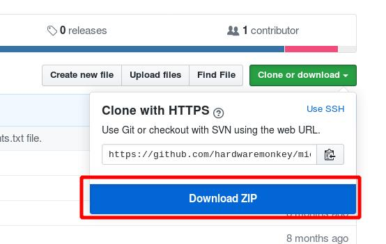
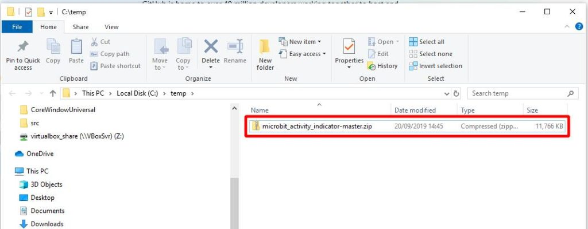
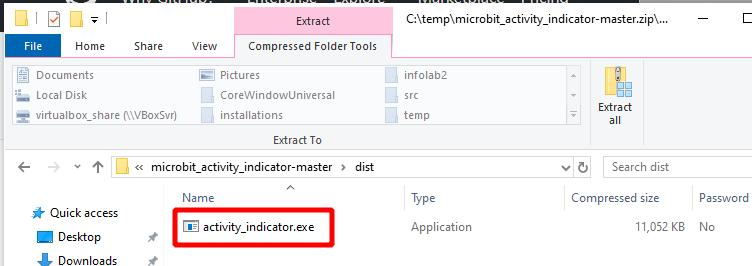
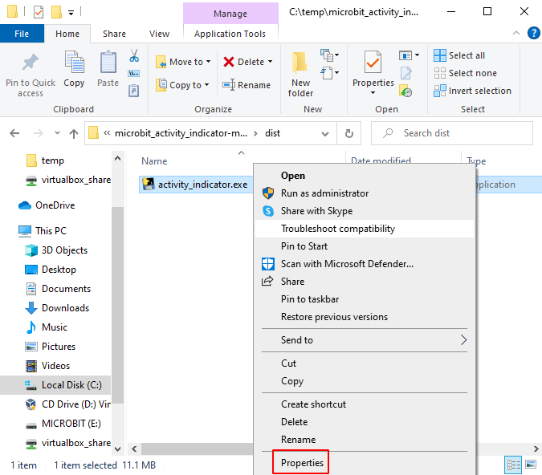
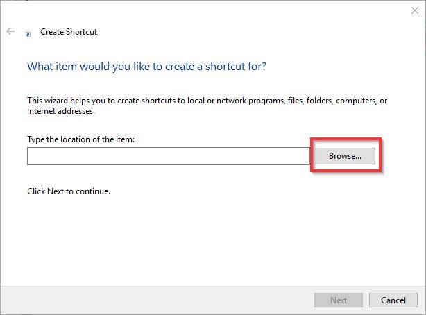
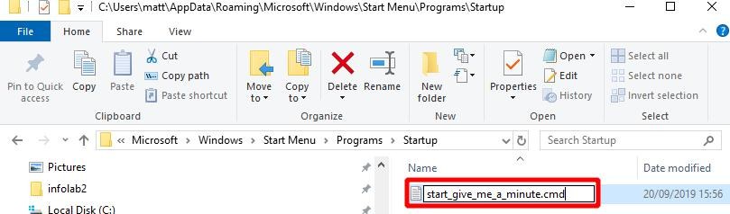

# Give Me a Minute set up and use instructions

[Matthew Oppenheim](matt.oppenheim@gmail.com)

This page details how to set up and use the [Give Me a Minute](https://www.seismicmatt.com/give-me-a-minute/) system to show when communication software is in use.

A YouTube video showing how to set up the system which complements these instructions can be [viewed here](https://youtu.be/MvV-veL01No)

The Project GitHub site is at [this link](https://github.com/hardwaremonkey/microbit_activity_indicator).

* November 2020 this manual is now rendered using [mkdocs](https://www.mkdocs.org/).
* 17th September 2020: Added how to unblock `activity_indicator.exe` the first time that it is run.
* 11th October 2019: Allows for the microbit to be disconnected and reconnected in use.
* 3rd October 2019: Changed how to run the program at start-up from using a .cmd file in the Startup directory to using a link.


## Introduction

It can be hard to know when an eye tracker user is composing speech on their communication device. The ‘Give me a minute’ project solves this by using a BBC micro:bit (microbit) to indicate when communication software, such as Sensory Software’s Grid 3 or Tobii’s Communicator, is in use. See the page: [Give Me a Minute](https://www.seismicmatt.com/give-me-a-minute/ for details, photos and videos of the system in action.

The ‘Give me a minute’ software works by looking for a change at the top of the communication software window twice a second. A microbit is attached to the communication device. When the text in the communication software is changed the microbit's LEDs flash. 

Let me know if these instructions can be improved.

### Testing

The system has been tested with Windows 8 and Windows 10 on Sensory Software’s Grid 2 and Grid 3 and Tobii’s Communicator software. 

### Components

* One microbit. This can be obtained for around £12. eBay is a good place to buy one. 

* A micro USB cable is needed to connect the microbit board to the device running the communications software. 

* An optional case can be bought for the microbit. 

## Set up - summary

I call the device which is running the communication software as the communication device. 

Connect the microbit using a micro USB cable from the microbit to the communication device. You do not need a battery pack for the microbit. The microbit is powered from the USB connection.


*    Install the driver for the microbit if you are not using Windows 10.
*   Connect the microbit using a USB cable to the device with the communication software on it.
*   Download the setup files from my GitHub site to the communication device.
*    Drag and drop the file ubit_flash.hex to the microbit.
*    Run Grid 2 or Grid 3 or Tobii Communicator.
*    Run `activity_indicator.exe`.
*    Optional: set up Windows so that the file `activity_indicator.exe` runs automatically at start-up.

### Regular use after setting up

Connect the microbit using a micro USB cable from the microbit to the device running the communication software.

Run Grid 2 or Grid 3 or Tobii Communicator.

Run the Windows software – double click on `activity_indicator.exe`. This is not necessary if you set up Windows to automatically run the software at start-up.

If the microbit is not plugged in you will see the message `no microbit found`. Plugin the microbit. The software allows for the microbit to be removed and plugged in during use. The screenshot below shows what you will see when the software is started with no microbit plugged in and no communication software running. You can start the communication software with the program running and it will be picked up. 

<figure>
  
  <figcaption>Display with no micro:bit connected.</figcaption>
</figure>

<figure>
  
  <figcaption>Display with micro:bit connected.</figcaption>
</figure>

When the communication software is running, the number of black pixels detected in the message window and the limit to trigger a detection is displayed. These are debugging messages to allow me to see what is happening with the software as I develop it. The detection limit can be changed using the command line - see the section 'Command line options to adjust sensitivity'. The screenshot below shows an example of a change detected in either Grid or Communicator.

<figure>
  
  <figcaption>Display when a change is detected.</figcaption>
</figure>

### Normal operation

When the micro:bit is plugged in, it should show a vertical bar on the LEDs. When the text at the top of a Grid or Communicator window changes, the bar should spin around. Pressing button A on the micro:bit causes this to happen as well. This feature is included so you can test the micro:bit is working. The picture below shows the vertical bar pattern on the LEDs.

<figure>
  
  <figcaption>micro:bit displays a static vertical bar when there is no user activity.</figcaption>
</figure>

### How the system works 

The amount of black text in the message window at the top of the communication software window is measured twice a second. When there is a change in the number of black pixels above a threshold, a trigger is sent to the micro:bit to display a moving pattern.

### Connecting the micro:bit to your Windows device

This connection should happen automatically with Windows 10. If you are using an earlier version of Windows, you will need to install the driver for the microbit. Detailed instructions on how to do this are on my blog post: [Connecting the BBC micro:bit to Windows](https://www.seismicmatt.com/2020/04/27/connecting-the-bbc-microbit-to-windows-and-adding-code-to-it/)

### Downloading the code for the microbit and the laptop/tablet from GitHub
Code for the micro:bit and the communications device needs to be downloaded and installed. This all lives on a GitHub 'repository'.

The simplest thing to do is to download the entire repository as a single .zip file from the GitHub site, then extract the folder we need from that.

Go to the GitHub site: [https://github.com/hardwaremonkey/microbit_activity_indicator](https://github.com/hardwaremonkey/microbit_activity_indicator)

Click on the `Clone or Download` button, indicated in the screenshot below.

<figure>
  
  <figcaption>GitHub site. Download all of the files as a single zip file, unless you are familiar with using git.</figcaption>
</figure>

<figure>
  
  <figcaption>Click on `Download ZIP` to download all of the site as a single zip file.</figcaption>
</figure>

The downloaded file is called microbit_activity_indicator.zip and is about 12 Mb large. 

<figure>
  
  <figcaption>Click on 'Download ZIP' to download all of the site as a single zip file.</figcaption>
</figure>

Unzip the .zip file somewhere. You can do this by right-clicking on the .zip file and selecting the option `Open`.

<figure>
  
  <figcaption>Unzipped repository.</figcaption>
</figure>

### Installing code on to the microbit

 The file called ubit_flash.hex needs to be dragged and dropped into the MICROBIT folder. This will program the board. If you are interested, the Micropython script that creates the .hex file is in ubit_flash.py. I put up all the code used in the project to enable anybody else to improve it.

 <figure>
  
  <figcaption>Drag and drop the file ubit_flash.hex to the MICROBIT folder.</figcaption>
</figure>

Wait about 10 seconds for the micro:bit to start to program. The light on the back of the micro:bit will then flash for about 10 seconds as it programs. Then a column of 3 LEDs should light. Press button A on the micro:bit. The bar should sweep around the LED display. 

The code will remain stored on the micro:bit and run whenever it is powered. The micro:bit can be left unpowered and the code will stay on the device for when you next connect it to the Windows device. If your code is loaded and working, please proceed to the next section. If you can't access the online editor, you can download the mu editor and install this on your PC to install the software to the microbit offline. The mu editor can be downloaded from: https://codewith.mu/

As the micro:bits are being distributed to all 11-12 year olds in the UK, if you get stuck installing code on to the micro:bit and live in the UK, find a friendly 11-12 year old to help you out.

### Installing the program that monitors for communication software use

In this step, we need to install the software that monitors Grid or Communicator on to the communication device.

The monitoring software is all in a single file called `activity_indicator.exe` which is in the directory called /dist (short for distribution) in the files that you downloaded and unzipped earlier. The screenshot below shows this:

<figure>
  
  <figcaption>activity indicator executable.</figcaption>
</figure>

To start the monitoring software, double click on the file `activity_indicator.exe`.

The first time that you try to do this creates a warning screen `Windows protected your PC`. You need to tell Windows that this is a friendly piece of software.

Right click on the file `activity_indicator.exe` and select `properties`:

<figure>
  
<figcaption>Select properties to find the security settings for the file.</figcaption>
</figure>

In the next menu, tick in the `unblock` tick box:

<figure>
  
<figcaption>Select unblock to enable the file to run without being an administrator.</figcaption>
</figure>

When you next double click on `activity_indicator.exe`, it will run without the warning window.

If a `VCRUNTIME140.dll missing error` pops up instead don’t panic! Go to section 'VCRUNTIME140.dll missing error' below.

A terminal should pop up with some messages. The messages are explained above in the section 'What happens in normal use'. Once you are happy that the software is running, this terminal can be minimised.

The software will look for an attached micro:bit. If a micro:bit is not found, the software will tell you this. Currently, the software looks for either Grid or Tobii Eyetracker communications software. If neither communications software is running, then the software will tell you this. The software will then print a message each time that a change is detected and send a signal to an attached micro:bit, which causes the micro:bit to display a short moving pattern.

If the micro:bit is disconnected when the script is running, you can reconnect the micro:bit and the software will reconnect with it.

If the `activity_indicator.exe` file does not run, you can download the Python script from the GitHub site and run that using Python. Instructions on how to download and install the necessary software to do this are included in this page in 'Running the Windows software from the Python script'. This is a bit more complex. Hopefully, you won't need to go there.

### Automatically running Give Me a Minute at startup 

Once you are happy that the software does what you want, you can set up Windows to automatically run the software on startup. 

This needs to be set up when logged in as the user who will be using the software. If different accounts are set up on the communication device, log in as the user will be using the microbit. 

‘Give me a minute’ can be set to run when Windows starts by adding a link to the activity.exe file in the Windows startup directory. The startup directory can be found by typing:
```
shell:startup 
```
into an explorer window at the top.

<figure>
  
<figcaption>Finding the directory where files go to automatically run at startup.</figcaption>
</figure>

This will take you to your Startup directory. This Startup directory is in a different location for each user account that Windows has for your system, which is why you need to be logged in as the user who wants `activity_indicator.exe` to run at startup. Everything in this directory automatically runs when Windows starts up. In this directory, right-click on the screen and select `New`, then `Shortcut` (second from the top) to create a link to where you saved `activity_indicator.exe`.

<figure>
  
<figcaption>Creating a shortcut to the file to run at startup.</figcaption>
</figure>

Now click on `Browse` and navigate to where you saved `activity_indicator.exe`.

<figure>
  
<figcaption>Select `Browse` and navigate to the activity_indicator.exe file.</figcaption>
</figure>

Select the file `activity_indicator.exe`, click `OK`, `Next` and `Finish`. 

<figure>
  
<figcaption>Select activity_indicator.exe, then click 'OK', 'Next' and 'Finish'.</figcaption>
</figure>

You should now have a new shortcut in your Startup directory.

<figure>
  
<figcaption>Shortcut to activity_indicator.exe in your start-up directory.</figcaption>
</figure>

Note: This will only automatically start for the user who created the Shortcut. If somebody else logs into the communication device using a different user account, a different Startup directory is used. So the Shortcut has to be in the Startup directory for the user who wants to use the activity indicator.

Ideally, this should be as far as you need to come.  Hopefully, the script is running correctly and starts whenever you start-up Windows. 

The script is robust to the micro:bit being removed and then plugged back in again.

If so, please leave a comment. If not, maybe something else in this guide can help. If you can't get the script running, please get in touch. 

# Auto-start for people running the script using Python 

This section details how to have the script run automatically when you start up your communication device if you are running the script through Python, e.g. using the command `python activity_indicator.py` in a terminal.

This command needs to go into a .cmd file in the same Startup directory as is used if you are automatically running the .exe file. This directory is detailed in the previous section.

The files in the Startup directory will only run for the user who created the file, so log onto Windows as the user who will be using the communication software.

Go to this Startup directory by typing `shell:startup` into the top of a file explorer as detailed in the last section. Create a file called e.g. start_give_me_a_minute.cmd by right clicking in the directory and selecting `New`, `Text Document`.

<figure>
  
<figcaption>Create a Text Document in the Startup directory.</figcaption>
</figure>

You can give the file any name that you like as long as it ends with .cmd. Files in this directory will run automatically when Windows is started.

<figure>
  
<figcaption>Give the file a name ending in .cmd.</figcaption>
</figure>

Right-click on the file name and select Edit from the drop-down menu.

Put the command that you use to start the script into this file, using the full path to the .py file. e.g. 
```
python c:\microbit_activity_indicator\dist\activity_indicator.exe
```
Save the file. This file will run whenever you start up Windows.

Ideally, this should be as far as you need to read in this guide. If everything is up and running, please leave a comment. If not, see if the rest of this guide can help you. If not, get in touch with me.

# Command line options to adjust sensitivity

Different setups have different sized screens and windows. So the threshold of detection may need to be adjusted to prevent false triggers from large blinking cursors or moving mouse arrows. Or the software may not be triggering as much as it should due to the text window being smaller than usual.

The threshold for detection can be adjusted from the command line.

If you open a terminal or PowerShell (type `powershell` into the search box in the bottom bar in Windows), go to the directory with the `activity_indicator.exe` file and type `activity_indicator.exe –help` (that is <two dashes>help) you will see a couple of command line parameters that can be used to adjust how the software runs. e.g.
```
.\activity_indicator.exe -help
```
output:
```
Usage: activity_indicator.exe [OPTIONS]

–limit INTEGER Number of changed pixels to trigger event. Default is 3.

–fraction FLOAT Fraction of screen, from the top, to monitor. Default is 0.2.

–help Show this message and exit.
```
The `–limit` parameter allows you to tune how sensitive the watched area of the AAC software is to change. This is useful as different panels have different sizes.

The `–fraction` parameter allows you to change the fraction of the AAC screen that is monitored for a change. Usually we only need to watch the top 20% or so, as this is where the text appears.

<figure>
  
<figcaption>Using PowerShell to adjust command line properties of activity_indicator.exe.</figcaption>
</figure>

# VCRUNTIME140.dll missing error 

If a `VCRUNTIME140.dll missing error` pops up instead don’t panic! The code relies on some Microsoft Visual Studio libraries being installed. You should put the error you get into the Google machine to find the correct Visual Studio download as this changes as new versions are released. At the time of writing, this link was: [https://www.microsoft.com/en-us/download/details.aspx?id=52685](https://www.microsoft.com/en-us/download/details.aspx?id=52685)

# Running the Windows software from the Python script 

 If the Windows executable does not work, then the Python script can be run instead. To do this, Python needs to be installed along with a few libraries that are not part of the standard installation.

Hopefully you will not need to do this.

# Python software installations 

We need to install python3.6 (or a newer version) and a few Python libraries. This guide was written when Python 3.6 was the latest and greatest. Substitute whichever version you are using in the following instructions. 
 
The python libraries required are listed in the file ‘requirements.txt’ in the GitHub site so that those of you who know how to use virtual environments can use this to quickly set up a compatible work space. Otherwise, follow the instructions below to install the software needed to run activity_flasher.py.

Download and install the latest 64-bit python3 installation from: 

[https://www.python.org/downloads/windows](https://www.python.org/downloads/windows/)

Click on the ‘custom installation’ button so that the software can be installed to c:\python36 so that all users can access it. By default, the installer will install Python into the user directory for whoever is logged on, which means that python will not be available to other users.

There are a few libraries that need to be installed that the python script uses. These are pyserial and pyhook. After installation, these libraries will be in 
```
c:\python36\lib\site-packages
```
Instructions on how to install these libraries are given below.

# Installing pyserial library 

Pyserial allows python to use the serial port to communicate with the microbit. This can be installed using the pip utility. Pip is a tool that downloads and installs python libraries from the pypi repository. It automagically gets the correct version for the version of python you are using.

From a terminal type:
```
pip install pyserial
```
If this fails, you may need the full path to the ‘pip’ command:
```
c:\python36\Scripts\pip3.6.exe install pyserial
```
This should install the pyserial library. If it fails, which can be due to automatic library installation being blocked by Draconian IT measures, then we can install it directly from a .whl file called:
```
pyserial-3.4-py2.py3-none-any.whl
```
‘This file is either bundled with this documentation, or can be downloaded from the site referred to in the section ‘Additional Python libraries needed’.

To install pyserial from the .whl file, from a terminal type:
```
c:\python36\Scripts\pip3.6.exe install <path to the .whl file>
```

# Installing pywin32 

 The pywin32 library collection includes the library and dynamic linked library (dll) for pythoncom which are required by the python script. To install this, double click on the file:
```
pywin32-223.win-amd64-py3.6.exe
```
This file is either bundled with these instructions or can be downloaded from the site referred to in the section ‘Additional Python libraries needed’.

# Installing the click library

From a terminal type:
```
pip install click
```
If this fails, you may need to type the complete path to the pip command:
```
c:\python36\Scripts\pip3.6.exe install click
```
This library allows parameters to be passed to the script from the command line, such as –limit and –fraction.

# Summary of additional Python libraries needed 

 pyserial-3.4-py2.py3-none-any.whl, installed using ‘pip install pyserial’ or downloaded from: [https://pypi.python.org/pypi/pyserial](https://pypi.python.org/pypi/pyserial)

pywin32-223.win-amd64-py3.6.exe downloaded from: [https://github.com/mhammond/pywin32/releases/download/b223/pywin32-223.win-amd64-py3.6.exe](https://github.com/mhammond/pywin32/releases/download/b223/pywin32-223.win-amd64-py3.6.exe)


Pillow-4.2.1-cp36-cp36m-win_amd64.whl, installed using ‘pip install pillow’ or downloaded from: [https://pypi.python.org/pypi/Pillow/4.2.1](https://github.com/mhammond/pywin32/releases/download/b223/pywin32-223.win-amd64-py3.6.exe)

# Running the python script 

 The python script is called activity_indicator.py. Download this from the github site and save it in a directory on your local hard drive. Run the script using:
```
c:\python36\python.exe activity_indicator.py
```

# Board cover

A case or cover can be bought for the microbit for around £5. The kittenbot silicone cases make the boards look cheerful. Have a look at the photo on the project page to see what one looks like. The only disadvantage of the silicone cases is that it is hard to stick them to the back of the communications device. Sticking the USB cable or cable connector down instead is one solution to fixing the board and cover to the back of the communication device.

# Problems 

## Microbit is connected, but the software tells you that no microbit is found

If a microbit is plugged in and you still get the message that there is no microbit connected, then the microbit driver is not installed. Look at ‘Installing the microbit driver’.

## Microbit is continually flashing

Any window on top of the white message bar at the top of the Grid or Communicator window will be read. So if you put the program output terminal on top of the Grid or Communicator window, any updates in the terminal will register as a change, forming a feedback loop.

## Microbit doesn’t flash for single letters being added or deleted

Different size displays will have different numbers of pixels used for each letter, so getting an ideal threshold that detects a change in the text while not triggering for moving the mouse cursor into the text window for all displays is difficult. Adjust the trigger threshold as detailed in ‘Command line options’.

## No response after moving the Grid or Communicator window to a different screen

If you drag the communication software window from the screen in which it was started to a different monitor, the software stops tracking it. This is only an issue if you have more than one monitor.

# Getting help

Let me know of your issues and I’ll try to fix them. I work at sea for half of the year, but I’ll do what I can if I am offshore. Please use the email address at the top of this document.

# Background

The need for this software was identified at Beaumont College, Lancaster, UK by Fil McIntyre, the Lead Technologist at the College. Prototypes were successfully tested at Beaumont with student volunteers from the College. More project details can be found on the page: 
[https://www.seismicmatt.com/give-me-a-minute/](https://www.seismicmatt.com/give-me-a-minute/)

If you want to download and improve the code from the GitHub site, please go ahead. The link is at the head of this document. Let me know of any enhancements that you think would benefit the project.

Matthew Oppenheim, InfoLab21, Lancaster University 2019